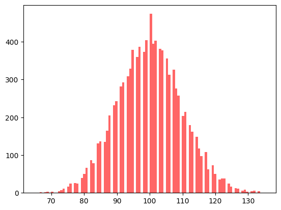
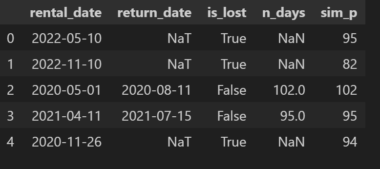
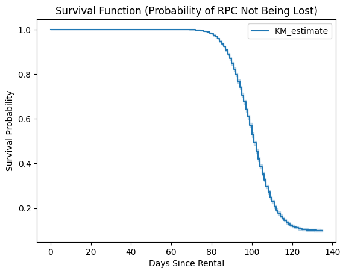
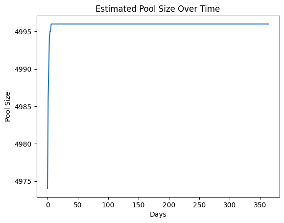

# **IFCO Data Science Challenge**

This repository contains the solution to the IFCO Data Science Challenge. The project uses Docker for consistent and reproducible results and demonstrates survival analysis and pool size estimation based on simulated data.

---

## **Project Overview**
1. **Challenge Goals**:
   - Estimate the shrinkage rate (probability of an asset not returning from a trip).
   - Estimate the pool size (number of assets available at any given time).

2. **Key Features**:
   - Simulation of trip durations using a Poisson distribution.
   - Survival analysis using Kaplan-Meier estimators.
   - Pool size estimation over time.

3. **Requirements**:
   - Python 3.8+
   - Docker installed on your machine.

---

## **Getting Started**

### **1. Build the Docker Image**
Navigate to the project directory where the `Dockerfile` is located. Use the following command to build the Docker image:

```sh
docker build -t ifco-data-science-env .
```

### **2. Run the Docker Container**
Run the Docker container with port binding and volume mapping:

```sh
docker run -it --rm -p 8888:8888 -v ${PWD}:/app ifco-data-science-env
```

If port `8888` is already in use, you can replace it with another port, e.g., `8899`:

```sh
docker run -it --rm -p 8899:8888 -v ${PWD}:/app ifco-data-science-env
```

---

## **How to Use**

### **Jupyter Notebook**
1. When the container starts, you’ll see a Jupyter Notebook URL in the terminal.
2. Copy the URL into your browser to access the Jupyter environment.
3. Open the `scripts/solution.ipynb` file to view or run the analysis.

### **Image Output**
Simulation results, including the Poisson distribution plot, are saved in the `.images/` directory. The primary image is:

- **Poisson Distribution**: `.images/poisson_dist.png`

---

## **Project Structure**

```
├── Dockerfile             # Docker instructions for environment setup
├── scripts/               # Python scripts and Jupyter notebooks
│   └── solution.ipynb     # Main analysis notebook
├── .images/               # Directory for output images
│   └── poisson_dist.png   # Poisson distribution plot
│   └── estimated_pool_size.png   # Poisson distribution plot
│   └── survival_function.png   # Poisson distribution plot
│   └── trip_duration.png   # Poisson distribution plot
├── README.md              # Project documentation
└── requirements.txt       # Python dependencies
```

---

## **How to Reproduce Results**

1. Follow the steps to build and run the Docker container.
2. Open the Jupyter Notebook `analysis.ipynb`.
3. Run all cells to reproduce the simulation and analysis.
4. Generated plots, like `poisson_dist.png`, will automatically be saved to the `.images/` folder.

---

## **Dependencies**

Dependencies are managed via the `requirements.txt` file. These include:
- `numpy`: For simulations and numerical operations.
- `matplotlib`: For plotting.
- `pandas`: For data manipulation.
- `lifelines`: For survival analysis.

The Dockerfile automatically installs these dependencies when building the image.

---

## **Explanation of solution**

The two questions:
- Develop a model to estimate the shrinkage rate, i.e. the probability of an asset not returning from a trip
- Develop a model to estimate the pool size, i.e. the amount of assets available to IFCO at a given time.

Firts, our assumptions and simulated data:

We have the following variables:

```sh
# given mean trip duration
mean_trip = 100
# assumed standard deviation
std_trip = 20
# number of trips
n_trip = 10000
# % RPC lost
shrinkage_rate = 0.1 
```

- `mean_trip`: Is given by the excercise
- `std_trip`: Is assumed
- `n_trip`: Number of simulations of assets
- `shrinkage_rate`: Assumptions, it may defer and change the results.

We use these variables to simualte our data.

We decided to follow the analysis with a poisson distribution to simualted the `trip_duration`. (Also a normal distribution was tried but we have only the mean.)

```sh
# simulating a trip duration with poisson distribution
sim_p = np.random.poisson(100,10000)

plt.hist(sim_p, bins=100, alpha=0.6, color='r')
```


After that we have simulated the rental dates of each asset, starting at 2020-01-01. And also imputing which of the assest are going to be lost.



### ***Shrinkage rate**

Now, to answer the first question, we are going to use a survival algorithm to know the probability of an asset to be lost given the trip duration.
`KaplanMeierFitter()`



Here, we can observe that after 80 days of trip duration the probability of survival is decreasing. And after 100 days the probability is around 50%.
Finally after 133 days only survives the 10% of the assets.

This is important because the survival probability is the counter part of the shrinkage rate, thus 90% of the assets survives at day 87.

### **Pool size**

To answer the second question we can provide a simulation.

Our assumptions:
- We know the day an asset is out.
- `rental_rate`: Average number of asset rented per day (As we are simulating and we do not have more info. this is our assumption) 
- `shrinkage_rate`: 0.1 

Variables:
- `days_to_simulate`: One year
- `initial_pool_size`: 5000 assets at t=0
- `available_assets`: Assets at n-day



We see that our pool size is quite stable after a few days. This is because:

- We know the rental date of all the assets out. This simplify the process as we know in advance when an assets is going to be used.
- We are assuming that the rental rate os assets is constant. In a real example, this can vary per seasonal components, routes, distributors, geografical reason.

### **Bonus questions**
- How are shrinkage rate and pool size related?
The shrinkage rate and the pool size (incremental) are complementary as the assets 'survived' are part of the pool size at given day. 
On the other hand, the shrinkage rate are the ones that not survived the process.

- Bonus: How would switching to scenario two change your approach, which limitations would be introduced?
If we have only th rental date of a percentatge of the assets, we can simulate an extra random number of assets delivered each day.
This is going to complicate the process as first:
- Do we have info of the generation distribution of the rental dates?
- We have to be very carefull of having always stock for new rentals.

To mitigate this:
- Use statistical imputation techniques or Bayesian methods to estimate unobserved rentals.
- Incorporate historical trends and seasonal patterns to refine rental rate assumptions.

---

### Future Work:

- Seasonal components: As we are dealing with simulated data, we cannot infer more variables as seasonality, route, etc
- Complex models that can enhance prediction power, as Cox Proportional Hazards that allows more variables.
- Define a metric that can mix business and precision, for example introduce the cost of losing one asset. 

---

## **Contact**

If you have any questions or feedback, feel free to reach out.